<div align="center">

# 🎬 Movie Maven

### Discover. Watch. Review.

A feature-rich Flutter movie discovery application combining real-time movie data, personalised recommendations, review sentiment analysis, user collections, subscription management, plan upgrades, and integrated payment flows.

</div>

---

## 📖 Overview

**Movie Maven** is a cross-platform movie discovery application built with **Flutter and Dart**. It provides a complete movie-browsing experience where users can create an account, verify registration through OTP, discover movies, search and browse by genre, explore detailed movie information, manage favourites and watchlists, submit reviews, receive sentiment feedback, purchase subscription plans, upgrade their existing subscription, and manage their profile.

The application integrates **The Movie Database (TMDB)** for movie content, **SQLite** for local data persistence, a **content-based recommendation engine** for personalised movie suggestions, a **TensorFlow Lite** model for review sentiment analysis, and **PayPal / eSewa** payment flows for subscription purchases.

<p align="center">
  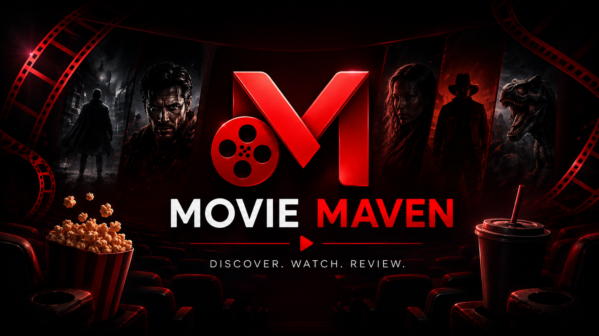
</p>

---

## ✨ Key Features

- 🔐 **User Authentication** — Registration, login, OTP verification, forgot password and password reset flows.
- 🎞️ **Movie Discovery** — Browse upcoming, trending, recommended, top-rated and popular movies.
- 🔎 **Movie Search** — Search movie data directly by title.
- 🎭 **Genre Browsing** — Explore movie genres and dedicated genre result pages.
- 🎬 **Movie Details** — View posters, ratings, movie information, trailers, recommendations and reviews.
- 🧠 **Content-Based Recommendations** — Generate related movie suggestions using genre features and cosine similarity.
- 💬 **Reviews & Sentiment Analysis** — Submit written reviews with star ratings and view sentiment feedback.
- ❤️ **Favourites** — Save and manage favourite movies.
- 📋 **Watchlist** — Maintain a personal collection of movies to watch later.
- 💎 **Subscriptions & Plan Upgrades** — Purchase a subscription, view the active plan and upgrade to other available subscription models.
- 💰 **Payment Integration** — Complete subscription purchases and upgrades through PayPal Sandbox and eSewa payment flows.
- 👤 **Profile Management** — View and edit user information and access account controls.

---

## 🛠️ Technology Stack

| Area | Technologies |
|---|---|
| **Application** | Flutter, Dart |
| **UI** | Flutter Material Components |
| **Movie Data** | TMDB API, `tmdb_api`, HTTP |
| **Local Storage** | SQLite, `sqflite` |
| **Recommendation Engine** | Content-based filtering, genre feature vectors, cosine similarity, Dart isolates |
| **Sentiment Analysis** | TensorFlow Lite, `tflite_flutter` |
| **Reviews** | Local SQLite reviews + TMDB review data |
| **Authentication** | Local user database, OTP verification flow |
| **Email / OTP** | `mailer` |
| **Subscriptions** | Multiple subscription models with purchase and upgrade states |
| **Payments** | PayPal, eSewa Flutter SDK |
| **Video / Trailers** | YouTube Player Flutter, Video Player |
| **Additional Packages** | Flutter Rating Bar, Image Picker, Camera, Path Provider |

---

# 📱 Application Showcase

## 🔐 Authentication & OTP Verification

Movie Maven provides a complete authentication journey beginning with registration and login.

New users can create an account and continue through a **4-digit OTP verification screen** before accessing the application.

<p align="center">
  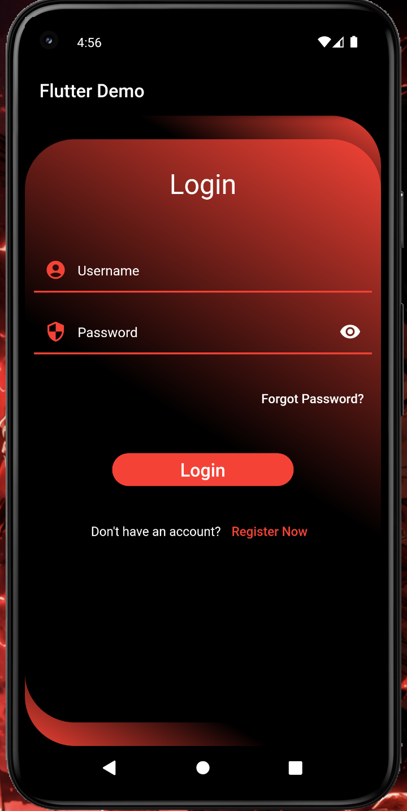
  &nbsp;&nbsp;
  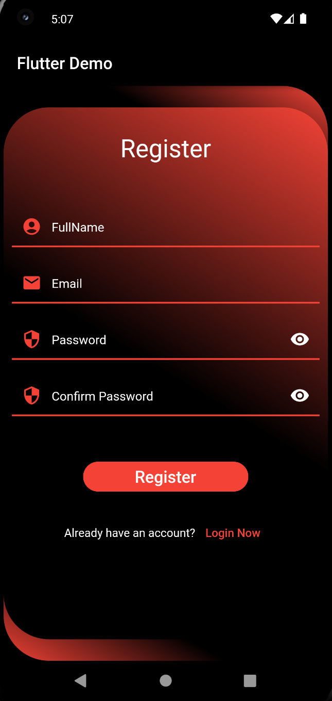
  &nbsp;&nbsp;
  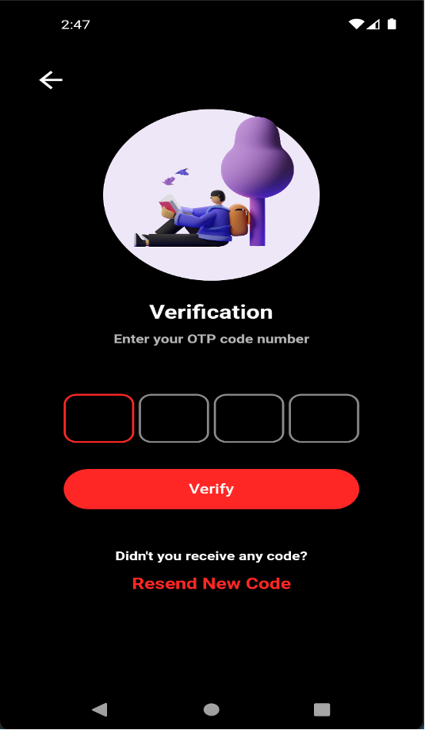
</p>

<p align="center">
  <sub>
    <b>Login</b>
    &nbsp;&nbsp;&nbsp;&nbsp;&nbsp;&nbsp;
    <b>Registration</b>
    &nbsp;&nbsp;&nbsp;&nbsp;&nbsp;&nbsp;
    <b>OTP Verification</b>
  </sub>
</p>

---

## 🔑 Password Recovery

Movie Maven also provides dedicated **Forgot Password** and **Reset Password** interfaces as part of the account-management experience.

<p align="center">
  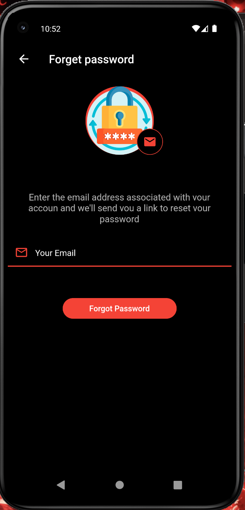
  &nbsp;&nbsp;&nbsp;
  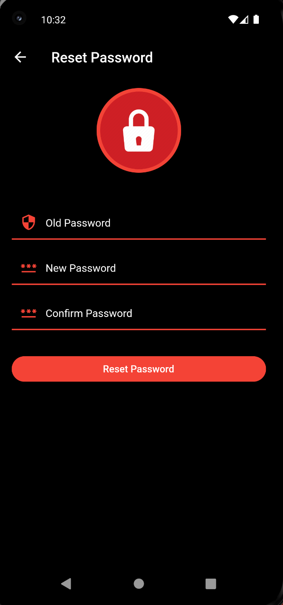
</p>

<p align="center">
  <sub>
    <b>Forgot Password</b>
    &nbsp;&nbsp;&nbsp;&nbsp;&nbsp;&nbsp;
    <b>Reset Password</b>
  </sub>
</p>

---

## 🏠 Home & Movie Discovery

The Movie Maven home screen brings multiple movie-discovery feeds together within a single interface.

Users can explore:

- Upcoming movies
- Trending movies
- Recommended movies
- Top-rated movies
- Popular movies

<p align="center">
  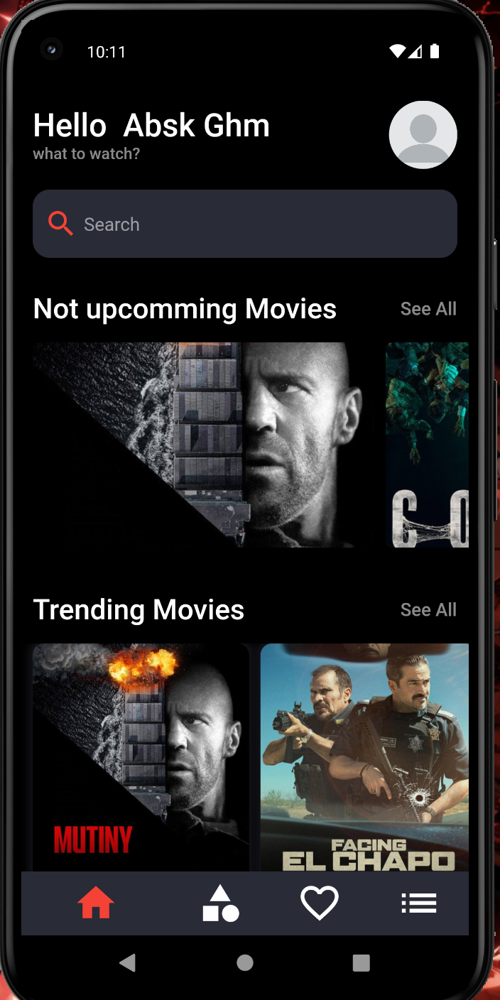
  &nbsp;&nbsp;
  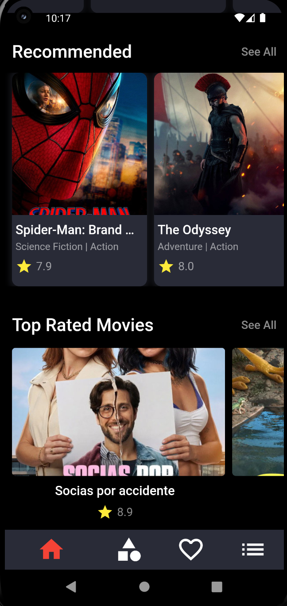
  &nbsp;&nbsp;
  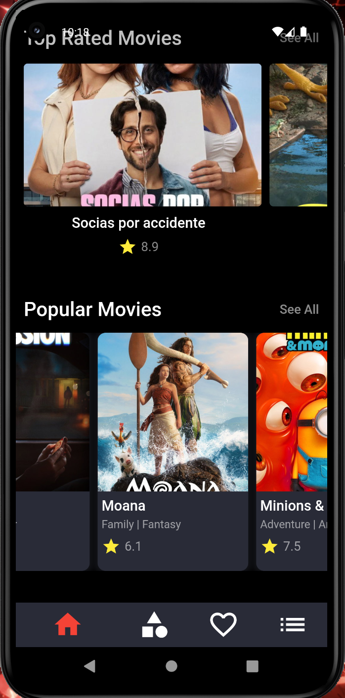
</p>

<p align="center">
  <sub>
    <b>Home</b>
    &nbsp;&nbsp;&nbsp;&nbsp;&nbsp;&nbsp;
    <b>Recommended & Top Rated</b>
    &nbsp;&nbsp;&nbsp;&nbsp;&nbsp;&nbsp;
    <b>Top Rated & Popular</b>
  </sub>
</p>

---

## 🎬 Movie Details

Selecting a movie opens a dedicated details page containing movie artwork, title, rating, overview information, collection controls, recommendations, reviews and trailer functionality.

<p align="center">
  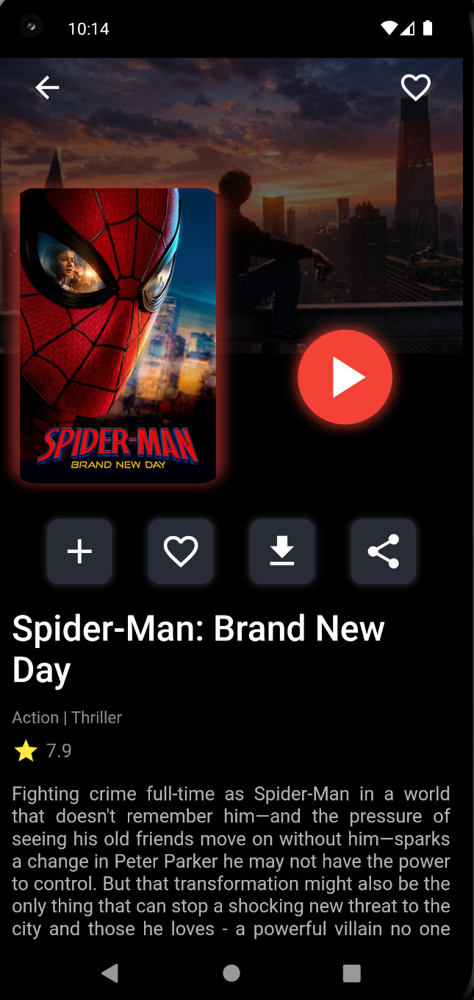
  &nbsp;&nbsp;&nbsp;
  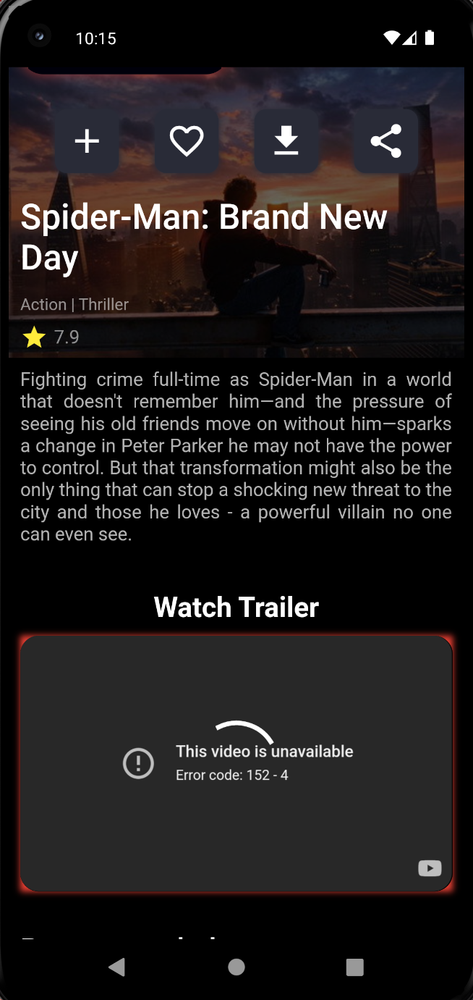
</p>

<p align="center">
  <sub>
    <b>Movie Information</b>
    &nbsp;&nbsp;&nbsp;&nbsp;&nbsp;&nbsp;
    <b>Trailer Integration</b>
  </sub>
</p>

---

# 🧠 Content-Based Movie Recommendation System

One of Movie Maven's core technical features is its **content-based movie recommendation system**.

Rather than simply displaying generic movie lists, Movie Maven contains a recommendation pipeline that analyses movie characteristics and identifies similar titles.

### Recommendation Pipeline

1. Movie data is loaded from the bundled `main_data.csv` dataset.
2. Genre information is extracted from the dataset.
3. Genres are transformed into movie feature vectors.
4. A feature matrix is constructed for the available movies.
5. **Cosine similarity** is calculated between movie vectors.
6. Similarity calculations are processed using a separate **Dart isolate**.
7. Movies with stronger similarity scores can then be presented as related recommendations.
8. Recommended movie titles are connected back to movie information displayed by the application.

### Cosine Similarity

The recommendation engine measures similarity between movie vectors using cosine similarity:

```text
                       A · B
cosine_similarity = -----------
                      |A| |B|
```

A larger cosine similarity score indicates that two movies share more similar content characteristics.

<p align="center">
  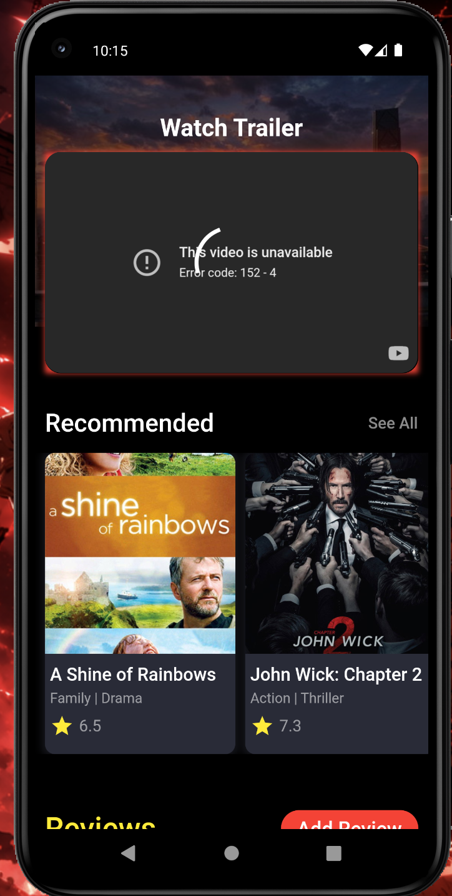
</p>

<p align="center">
  <sub><b>Content-Based Movie Recommendations</b></sub>
</p>

---

# 💬 Reviews, Ratings & Sentiment Analysis

Movie Maven allows users to contribute their own reviews directly from a movie's details page.

Users can:

- Write a movie review
- Provide a star rating
- Submit the review
- View the submitted review
- Receive sentiment feedback

The project incorporates a **TensorFlow Lite sentiment-analysis component** for analysing movie-review text.

<p align="center">
  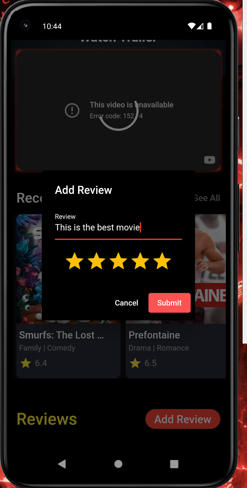
  &nbsp;&nbsp;
  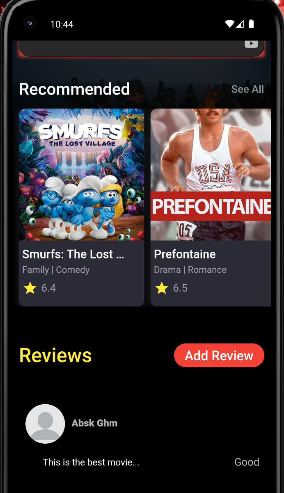
  &nbsp;&nbsp;
  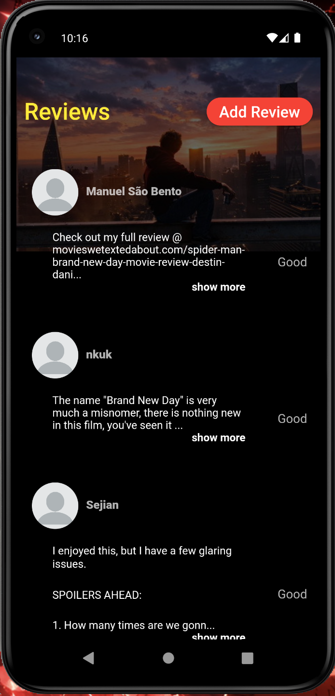
</p>

<p align="center">
  <sub>
    <b>Write & Rate</b>
    &nbsp;&nbsp;&nbsp;&nbsp;&nbsp;&nbsp;
    <b>Submitted Review</b>
    &nbsp;&nbsp;&nbsp;&nbsp;&nbsp;&nbsp;
    <b>Sentiment Analysis</b>
  </sub>
</p>

### Review Flow

```text
User Opens Movie
       │
       ▼
   Add Review
       │
       ├── Review Text
       │
       └── Star Rating
       │
       ▼
 Submit Review
       │
       ▼
Review Displayed
       │
       ▼
Sentiment Analysis
       │
       ▼
 Sentiment Result
```

---

# 🎭 Genre Discovery

Movie Maven allows users to browse available movie genres and navigate into dedicated genre collections.

The example below demonstrates the transition from the genre directory to the **Animation** movie category.

<p align="center">
  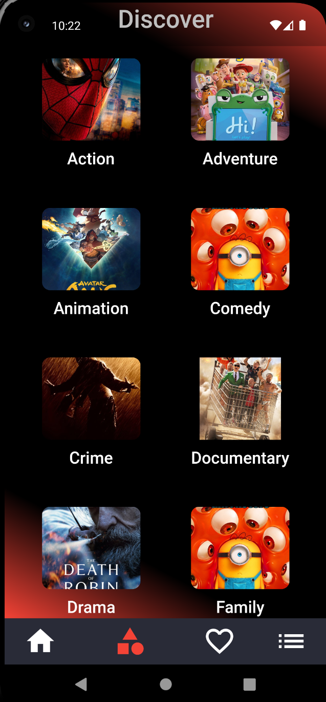
  &nbsp;&nbsp;&nbsp;
  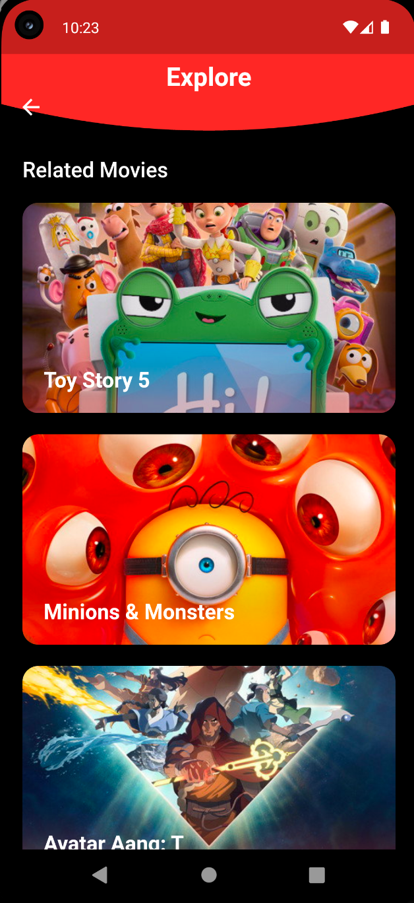
</p>

<p align="center">
  <sub>
    <b>Browse Genres</b>
    &nbsp;&nbsp;&nbsp;&nbsp;&nbsp;&nbsp;
    <b>Animation Results</b>
  </sub>
</p>

---

# 🔎 Movie Search

Movie Maven includes dedicated movie-search functionality.

Users can enter a movie title and receive matching movie results, which can then be opened directly in the movie-details interface.

<p align="center">
  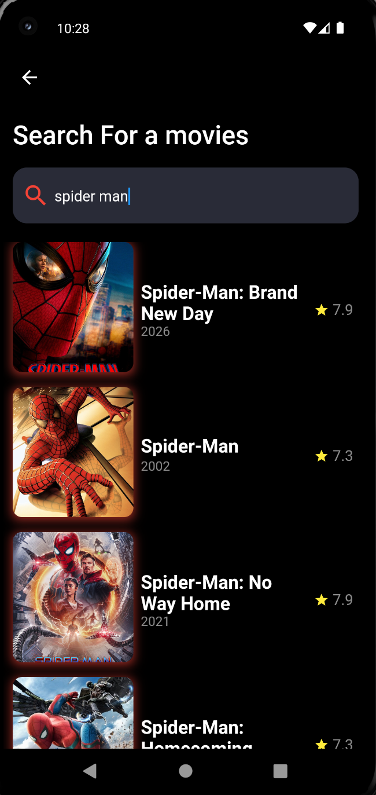
</p>

<p align="center">
  <sub><b>Search Results</b></sub>
</p>

---

# ❤️ Favourites & 📋 Watchlist

Movie Maven provides two personalised movie collections.

### ❤️ Favourites

Users can save movies they particularly like to their personal favourites collection.

### 📋 Watchlist

Movies that users intend to watch later can be stored separately within the watchlist.

These user collections are persisted using **SQLite**.

<p align="center">
  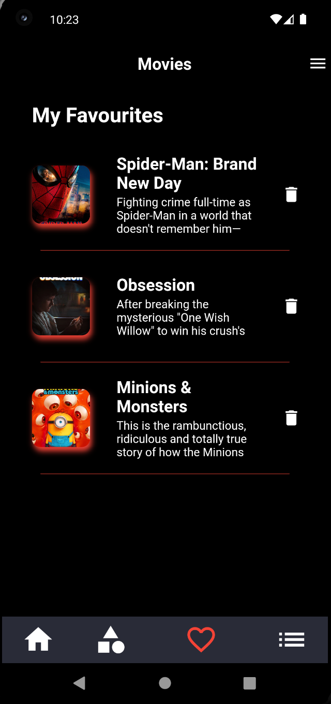
  &nbsp;&nbsp;&nbsp;
  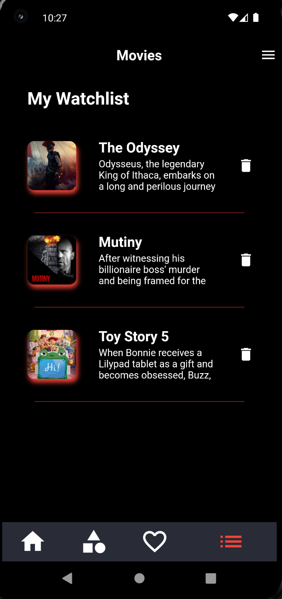
</p>

<p align="center">
  <sub>
    <b>My Favourites</b>
    &nbsp;&nbsp;&nbsp;&nbsp;&nbsp;&nbsp;
    <b>My Watchlist</b>
  </sub>
</p>

---

# 💎 Subscription & Plan Upgrades

Movie Maven includes a multi-tier subscription system.

Users can:

- 🛒 **Purchase** a new subscription plan
- ✅ View their currently **Purchased** plan
- ⬆️ **Upgrade** to another available subscription model
- 💳 Select a payment method during purchase or upgrade
- 💰 Continue payment through **PayPal** or **eSewa**

Multiple subscription durations are available, giving users flexibility when choosing their preferred plan.

### Dynamic Subscription State

Before a subscription has been purchased, available plans display a **Buy** option.

After purchasing a subscription:

- The active plan is displayed as **Purchased**
- Other eligible subscription models display **Upgrade**
- Users can choose another model when they want to upgrade their subscription

<p align="center">
  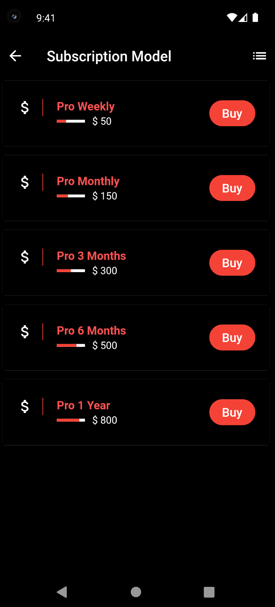
  &nbsp;&nbsp;&nbsp;
  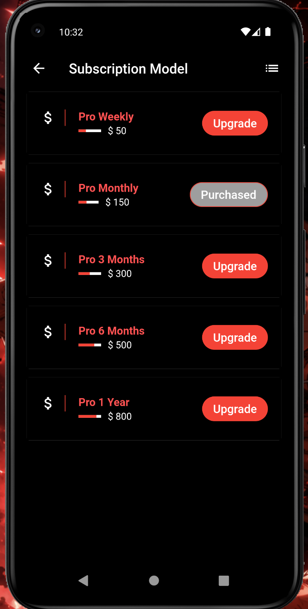
</p>

<p align="center">
  <sub>
    <b>Choose & Buy a Plan</b>
    &nbsp;&nbsp;&nbsp;&nbsp;&nbsp;&nbsp;
    <b>Purchased Plan & Upgrade Options</b>
  </sub>
</p>

### Subscription Journey

```text
Select Subscription
        │
        ▼
       Buy
        │
        ▼
Choose Payment Method
        │
   ┌────┴────┐
   ▼         ▼
 PayPal     eSewa
   │         │
   └────┬────┘
        ▼
Payment Completed
        │
        ▼
Plan Marked "Purchased"
        │
        ▼
Other Plans Available
     for Upgrade
```

---

# 💳 PayPal & eSewa Payment Integration

After selecting a subscription model, Movie Maven allows users to choose between the available payment methods.

The application integrates:

- **PayPal Sandbox**
- **eSewa**

This payment workflow is used when purchasing subscription models and supports the application's subscription-management experience.

<p align="center">
  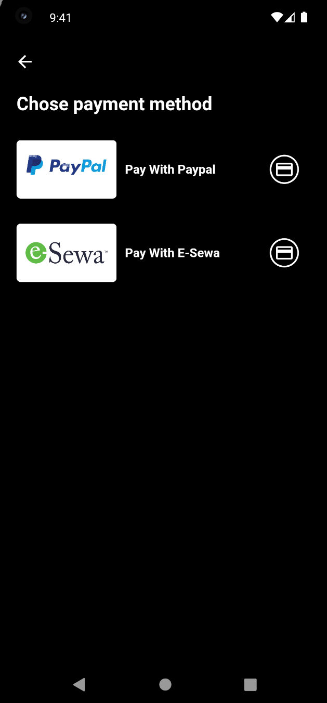
  &nbsp;&nbsp;
  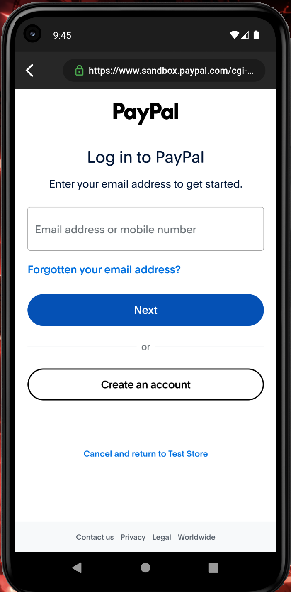
  &nbsp;&nbsp;
  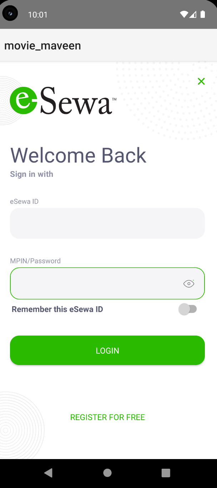
</p>

<p align="center">
  <sub>
    <b>Payment Method</b>
    &nbsp;&nbsp;&nbsp;&nbsp;&nbsp;&nbsp;
    <b>PayPal</b>
    &nbsp;&nbsp;&nbsp;&nbsp;&nbsp;&nbsp;
    <b>eSewa</b>
  </sub>
</p>

---

# 👤 Profile Management

Movie Maven includes a dedicated user-profile interface.

From the profile section, users can access account-related functionality including:

- My Account
- Settings
- Payments
- Subscriptions
- Reset Password
- Logout

A separate profile-editing interface allows users to update personal information.

<p align="center">
  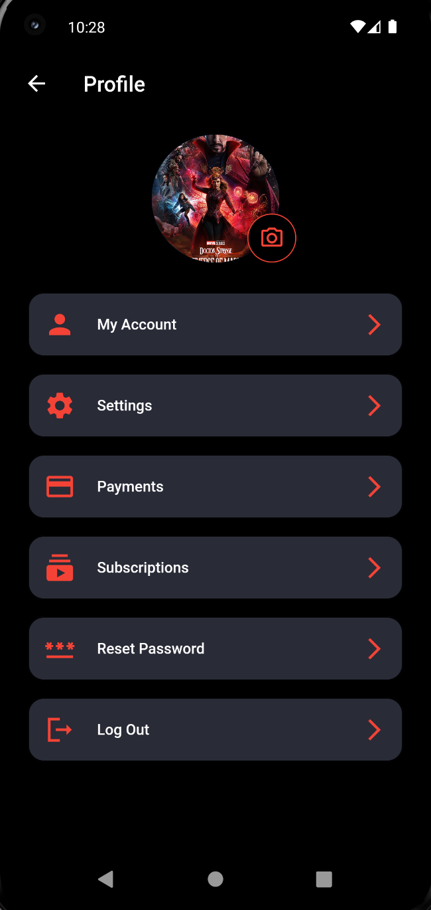
  &nbsp;&nbsp;&nbsp;
  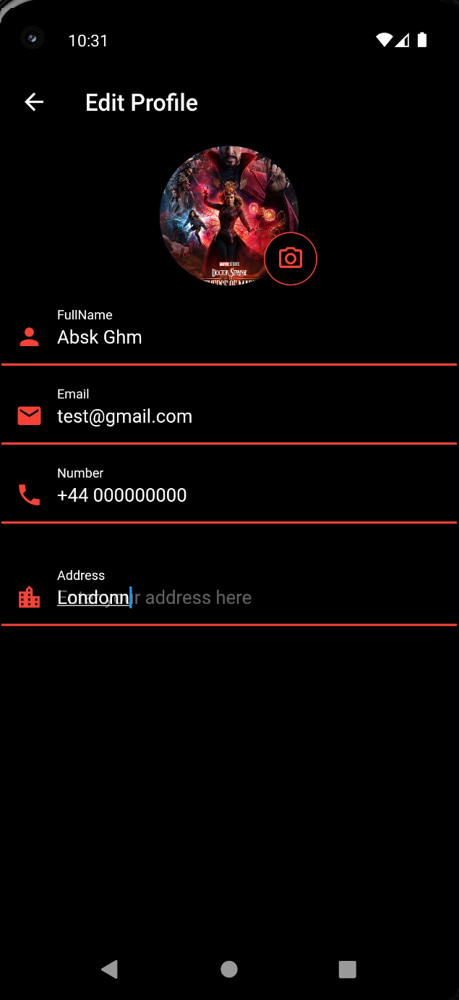
</p>

<p align="center">
  <sub>
    <b>User Profile</b>
    &nbsp;&nbsp;&nbsp;&nbsp;&nbsp;&nbsp;
    <b>Edit Profile</b>
  </sub>
</p>

---

# 🏗️ Application Architecture

Movie Maven combines remote movie information, locally persisted user information and machine-learning components within a Flutter application.

```text
                         ┌─────────────────────┐
                         │     MOVIE MAVEN     │
                         │    Flutter / Dart   │
                         └──────────┬──────────┘
                                    │
            ┌───────────────────────┼───────────────────────┐
            │                       │                       │
            ▼                       ▼                       ▼
     ┌─────────────┐         ┌─────────────┐         ┌──────────────┐
     │   TMDB API  │         │   SQLite    │         │ Local Assets │
     │             │         │             │         │              │
     │ Movie Data  │         │ User Data   │         │ CSV + TFLite │
     └──────┬──────┘         └──────┬──────┘         └──────┬───────┘
            │                       │                       │
            ▼                       ▼                       ▼
     Search / Genres          Authentication          Recommendation
     Movie Details            Favourites             Engine
     TMDB Reviews             Watchlist                   +
     Trailers                 Local Reviews           Sentiment Model
            │                       │                       │
            └───────────────────────┼───────────────────────┘
                                    │
                                    ▼
                         ┌─────────────────────┐
                         │ Subscription System │
                         │ Purchase / Upgrade  │
                         └──────────┬──────────┘
                                    │
                              ┌─────┴─────┐
                              ▼           ▼
                           PayPal       eSewa
```

---

# 🗃️ Local Data Management

Movie Maven uses **SQLite** to persist application-specific user information locally.

The local database supports core application functionality including:

- User accounts
- Favourite movies
- Watchlist entries
- User reviews
- Subscription information

This allows user-specific information to remain available while movie information can be retrieved separately from the movie-data service.

```text
                  SQLite
                     │
        ┌────────────┼────────────┐
        │            │            │
        ▼            ▼            ▼
      Users      Favourites    Watchlist
        │
        ├──────── Reviews
        │
        └──────── Subscriptions
```

---

# 🔄 Complete User Journey

```text
                        Launch
                          │
                          ▼
                        Login
                          ▲
                          │
                    Registration
                          │
                          ▼
                  OTP Verification
                          │
                          └──────────────► Login
                          │
                Forgot / Reset Password
                          │
                          ▼
                Subscription Selection
                          │
                          ▼
                  Choose Payment
                     │         │
                     ▼         ▼
                  PayPal     eSewa
                     │         │
                     └────┬────┘
                          ▼
                         Home
                          │
        ┌─────────────────┼─────────────────┐
        │                 │                 │
        ▼                 ▼                 ▼
      Search            Genres           Profile
        │                 │                 │
        ▼                 ▼                 ├── Edit Profile
      Movie ◄──────── Movie Results         ├── Subscription
      Details                              ├── Reset Password
        │                                  └── Logout
        │
        ├── Trailer
        ├── Recommendations
        ├── Reviews
        ├── Add Review
        ├── Sentiment Analysis
        ├── Favourite
        └── Watchlist
```

---

# 📂 Project Structure

```text
movie_maveen/
│
├── android/
├── ios/
├── web/
├── windows/
│
├── assets/
│   └── images/
│       ├── main_data.csv
│       ├── sentimental_predictor.tflite
│       └── ...
│
├── esewa_sdk/
│   └── esewa_flutter_sdk/
│
├── lib/
│   │
│   ├── main.dart
│   │
│   ├── login.dart
│   ├── register.dart
│   ├── otpScreen.dart
│   ├── forgetPassword.dart
│   ├── resetPassword.dart
│   │
│   ├── homePage.dart
│   ├── search.dart
│   ├── category.dart
│   ├── categoryDes.dart
│   ├── movieDetails.dart
│   │
│   ├── favourite.dart
│   ├── watchlist.dart
│   │
│   ├── profile.dart
│   ├── editProfile.dart
│   │
│   ├── payment.dart
│   ├── subscription.dart
│   │
│   ├── MyDatabse/
│   │
│   ├── models/
│   │   ├── recommeder.dart
│   │   └── goodBadClassifier.dart
│   │
│   └── widgets/
│
├── docs/
│   └── screenshots/
│
├── test/
│
├── pubspec.yaml
└── README.md
```

---

# 🚀 Getting Started

## Prerequisites

Before running Movie Maven, ensure that the following development tools are available:

- Flutter SDK
- Dart SDK
- Android Studio / Android SDK
- Android emulator or physical Android device
- TMDB API credentials
- Required test credentials for payment functionality

> **Compatibility Note:** Movie Maven was originally developed using the Flutter/Dart generation represented by the project's original SDK and dependency configuration. Running the project with significantly newer Flutter versions may require dependency or Android build-tool migration.

---

## 📥 Installation

Clone the repository:

```bash
git clone <your-repository-url>
```

Navigate into the project:

```bash
cd Movie-Maven
```

Install the Flutter dependencies:

```bash
flutter pub get
```

---

## 🔧 Verify the Development Environment

Check the Flutter environment:

```bash
flutter doctor -v
```

Check available devices:

```bash
flutter devices
```

---

## ▶️ Run Movie Maven

Run on an available device:

```bash
flutter run
```

To run on a specific Android emulator:

```bash
flutter run -d <device-id>
```

Example:

```bash
flutter run -d emulator-5554
```

---

## 📦 Build Android APK

Create a debug Android APK:

```bash
flutter build apk --debug
```

The generated APK can normally be found under:

```text
build/app/outputs/flutter-apk/app-debug.apk
```

---

# 🔑 API & Configuration

Movie Maven connects to external services including:

- TMDB
- Email / OTP services
- PayPal
- eSewa

Developer credentials should be supplied using an appropriate secure configuration mechanism.

Example configuration concept:

```text
TMDB_API_KEY=<your-key>
TMDB_ACCESS_TOKEN=<your-token>

PAYPAL_CLIENT_ID=<sandbox-client-id>
PAYPAL_SECRET=<sandbox-secret>
```

> ⚠️ **Security:** Never publish real passwords, API tokens, SMTP credentials, payment secrets or other private credentials in a public repository.

---

# 🧪 Implemented Application Flow

The application screenshots included in this repository demonstrate the Movie Maven user journey:

```text
Registration
     ↓
OTP Verification
     ↓
Login
     ↓
Subscription Selection
     ↓
Payment Method
     ↓
PayPal / eSewa
     ↓
Purchased Subscription
     ↓
Home
     ↓
Movie Discovery
     ↓
Search / Genre Browsing
     ↓
Movie Details
     ├── Trailer
     ├── Recommendations
     ├── Reviews
     ├── Ratings
     ├── Sentiment Analysis
     ├── Favourite
     └── Watchlist
     ↓
Profile Management
     ↓
Subscription Upgrade
```

---

# 🔮 Future Development

Movie Maven provides a strong foundation for further development.

Potential future extensions include:

- ☁️ Cloud-based authentication
- 🔄 Cross-device account synchronisation
- 🔐 Backend-managed credentials and secrets
- 💳 Server-side payment verification
- 🧠 Hybrid recommendation algorithms
- 👥 Collaborative filtering based on user behaviour
- 🎯 Viewing-history-based recommendations
- 📊 Expanded sentiment-analysis classes
- 📈 Review analytics and sentiment statistics
- 🔔 Push notifications
- 🎬 New-release notifications
- 📋 Watchlist release alerts
- ☁️ Cloud-hosted favourites and watchlists
- 💎 Cloud-managed subscription information
- 🧪 Expanded automated testing
- 🔄 CI/CD pipelines
- 📱 Updated Android and iOS build configurations

---

# 🎯 Project Highlights

> **Movie Maven combines movie discovery, recommendation techniques, sentiment analysis, persistent user collections, subscription upgrades and payment workflows within a single Flutter application.**

The project demonstrates practical experience across multiple areas of software development.

### Technologies & Concepts Demonstrated

`Flutter`

`Dart`

`REST APIs`

`TMDB`

`SQLite`

`Mobile Application Development`

`Content-Based Filtering`

`Recommendation Systems`

`Cosine Similarity`

`Dart Isolates`

`TensorFlow Lite`

`Sentiment Analysis`

`Local Data Persistence`

`Authentication`

`OTP Verification`

`Movie Search`

`API Integration`

`PayPal`

`eSewa`

`Subscription Management`

`Mobile UI/UX`

---

## 👨‍💻 Author

**Avishek Ghimire**

Computer Science Project — **Movie Maven**

---

<div align="center">

# 🎬 Movie Maven

### Discover. Watch. Review.

**Discover movies • Build your watchlist • Get personalised recommendations • Share your opinion**

</div>
